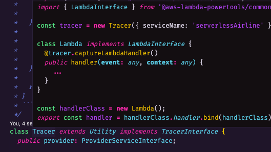

# Repro issue #1763

https://github.com/aws-powertools/powertools-lambda-typescript/issues/1763

> [!note]
> I was not able to reproduce this issue with the versions of the packages mentioned in the issue.

You can use the following command to install the dependencies: `npm ci`.

After opening in the IDE, I don't see any errors in the `index.ts` file, and I am able to build the project successfully using the `npm run build` command.

I am using the default `tsconfig.json` generated by running `npx tsc --init`, except for the `outDir` property which I have set to `./dist`, but that should not have any effect on the issue. 